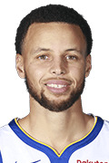

Workout 1
================
Daiki Ina

1) Introduction
---------------

> -   This report summarizes the shooting statistics of the five Golden State Warrior players: Iguodala, Green, urant, Thompson
> -   We introduce these five players with images and short descriptions.

| Description |      Value     |
|-------------|:--------------:|
| Name        | Andre Iguodala |
| Position    |      SG/SF     |
| Born        |    IL, 1984    |
| Height      |    6 ft 6 in   |

Andre Tyler Iguodalais an American professional basketball player for the Golden State Warriors of the National Basketball Association. The swingman was an NBA All-Star in 2012 and has been named to the NBA All-Defensive Team twice. Iguodala won an NBA championship with the Warriors in 2015, when he was named the NBA Finals Most Valuable Player. Iguodala helped the Warriors win two more championships in 2017 and 2018. He was also a member of the United States national team at the 2010 FIBA World Championship and 2012 Summer Olympics, winning the gold medal both times.

| Description |      Value     |
|-------------|:--------------:|
| Name        | Draymond Green |
| Position    |       PF       |
| Born        |    MI, 1990    |
| Height      |    6 ft 7 in   |

Draymond Jamal Green Sr. is an American professional basketball player for the Golden State Warriors of the National Basketball Association. Green, who plays primarily at the power forward position, is a three-time NBA champion and a three-time NBA All-Star. In 2017, he won the NBA Defensive Player of the Year.

| Description |     Value    |
|-------------|:------------:|
| Name        | Kevin Durant |
| Position    |      SF      |
| Born        |  D.C., 1988  |
| Height      |   6 ft 9 in  |

Kevin Wayne Durant is an American professional basketball player for the Golden State Warriors of the National Basketball Association. He played one season of college basketball for the University of Texas, and was selected as the second overall pick by the Seattle SuperSonics in the 2007 NBA draft. He played nine seasons in Oklahoma City before signing with Golden State in 2016, winning back-to-back championships in 2017 and 2018.

| Description |     Value     |
|-------------|:-------------:|
| Name        | Klay Thompson |
| Position    |       SG      |
| Born        |    CA, 1990   |
| Height      |   6 ft 7 in   |

Klay Alexander Thompson is an American professional basketball player for the Golden State Warriors of the National Basketball Association. He is credited as one of the greatest shooters in NBA history. He is a five-time NBA All-Star, a two-time All-NBA Third Team honoree, and a three-time NBA champion.

| Description |     Value     |
|-------------|:-------------:|
| Name        | Stephen Curry |
| Position    |       PG      |
| Born        |    OH, 1988   |
| Height      |   6 ft 3 in   |

Wardell Stephen Curry II is an American professional basketball player for the Golden State Warriors of the National Basketball Association. A six-time NBA All-Star, he has been named the NBA Most Valuable Player twice and won three NBA championships with the Warriors. Many players and analysts have called him the greatest shooter in NBA history. He is credited with revolutionizing the game of basketball by inspiring teams to regularly employ the three-point shot as part of their winning strategy

For the narrative part, we intuitively decided to foucus on Drayond Green.

2) Data
-------

> -   All tables have player name, total shots, made shots.

    ## # A tibble: 5 x 4
    ##   name           total  made perc_made
    ##   <fct>          <int> <int>     <dbl>
    ## 1 Andre Iguodala   210   134     0.638
    ## 2 Kevin Durant     643   390     0.607
    ## 3 Stephen Curry    563   304     0.540
    ## 4 Klay Thompson    640   329     0.514
    ## 5 Graymond Green   346   171     0.494

> -   This table shows 2PT Field Goal effective shooting percentage by player.

    ## # A tibble: 5 x 4
    ##   name           total  made perc_made
    ##   <fct>          <int> <int>     <dbl>
    ## 1 Klay Thompson    580   246     0.424
    ## 2 Stephen Curry    687   280     0.408
    ## 3 Kevin Durant     272   105     0.386
    ## 4 Andre Iguodala   161    58     0.360
    ## 5 Graymond Green   232    74     0.319

> -   This table shows 3PT Field Goal effective shooting percentage by player.

    ## # A tibble: 5 x 4
    ##   name           total  made perc_made
    ##   <fct>          <int> <int>     <dbl>
    ## 1 Kevin Durant     915   495     0.541
    ## 2 Andre Iguodala   371   192     0.518
    ## 3 Klay Thompson   1220   575     0.471
    ## 4 Stephen Curry   1250   584     0.467
    ## 5 Graymond Green   578   245     0.424

> -   This table shows overall Field Goal effective shooting percentage by player.

3) Narrative
------------

Draymond Green, the Power Forward of Golden State Warriors, was eclipsed in his shooting performance by his teammate in the season of 2016. Don't get me wrong. Green is an extraordinary black player, but his shooting skills seem indeed questionable.

If we take a look at "the 2PT Effective Shooting % by Player", Andre Iguodala, Kevin Durant, Stephen Curry and Klay-Thompson all reached the 50% effectiveness in scoring 2PT shots. Nevertheless, Green finished this season with a meager 49.4% chance of making 2PT shots.The poor capability of Green in shooting "halts the entire offense of the Golden State Warriors as what was once a great opportunity to shoot is now just another pass in the system", according to a Fansided review, ["Golden State Warriors: How bad has Draymond Green’s shooting been?."](https://bluemanhoop.com/2019/01/10/golden-state-warriors-how-bad-has-draymond-greens-shooting-been/)

Not only is Green underperforming in terms of 2PT shooting, "the 3PT Effective Shooting % by Player" table we have generated is also telling the same story. With regard to 3PT shooting, Green is likewise significantly dwarfed by his co-players in Golden State Warriors, with a lacklustre effectiveness of 31.9%, barely making his way down to below 30%. Green is also behind Andre Iguodala, who is in the fourth place of our table among five Golden State Warriors players with Green being the last, by an astonishing 4.1%.

Of course we can not possibly compare Draymond Green with Klay Thompson, who is one of the best 3PT shooters in NBA, and Stephen Curry, who is frequently considered by fans as one of the greatest 3PT shooters. Notwithstanding the fact that Green is teamed with those great 3PT shooters, his execution of 3PT shootings were not only indecisive but also maladroit. People can potentially argue that it is because other people on the team are too good in terms of 3PT shooting so that Green appears subpar. Still, according to "NBA Player 3-Point Shooting Statistics for PF- 2016-17" on ESPN, Green is the last but one among other players with the same position, with Aaron Gordon, who is a much younger player than Green, being the last. Sadly, Green honestly has a lot of space for improvements as a 3Pt shooter.

Last but not least, for the "Overall Effective Shooting % by Player", Green also fails miserably in his team by being the last with 42.4% effectiveness, behind Stephen Curry by a considerable 4.3%. To get a visualization of the overall effectiveness of shooting, let's take a look at the "Shot Charts: GSW (2016 Season)", Green's shooting attempts are scarce with highly concentrated and unsuccessful missing shots. Especially around the part of the field under the hoop, Green's missing shots are massive, with the successful shots almost completely overshadowed by the attempts that went awry. In juxtaposition, Green's teammates in Golden State Warriors present relatively well balanced shooting charts.

All in all Green is obviously incompetent in terms of shooting and this inadequacy of him is obtrusively conspicuous alongside his teammates. Even in 2018, Green's unsatisfactory shooting performance received a great deal of criticism from NBA analysts. An article from "SB Nation" brought to question ["Should Draymond Green continue shooting threes"](https://www.goldenstateofmind.com/2018/12/22/18152009/warriors-2018-draymond-green-three-point-shooting-rotation)?. Although this article went on a defensive side for Draymond Green, it apparently feels stilted and not buttressed by strong arguments. Another piece from "San Fransisco Chronicle" called ["Why Draymond Green’s shooting woes hurt Warriors more than you might think"](https://www.sfchronicle.com/warriors/article/Why-Draymond-Green-s-shooting-woes-hurt-13492428.php) hints at the insidious harm Green has been bringing to his team. These editorials validate that our analysis of the data coincides with the popular opinion.

I really hope Draymond Green can surprise us with improving shooting skills in the forthcoming seasons.

4) Reference
------------

> -   Wikipedia
> -   Basketball-reference.com
> -   FANSIDED
> -   SBNATION
> -   San Francisco Chronicle
